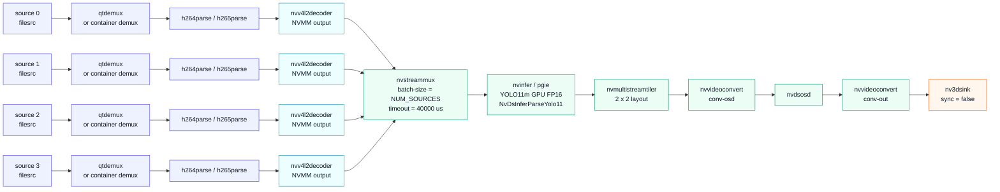
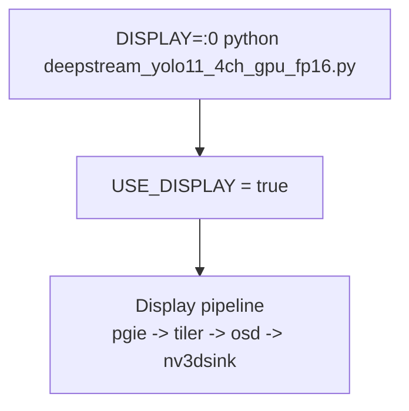
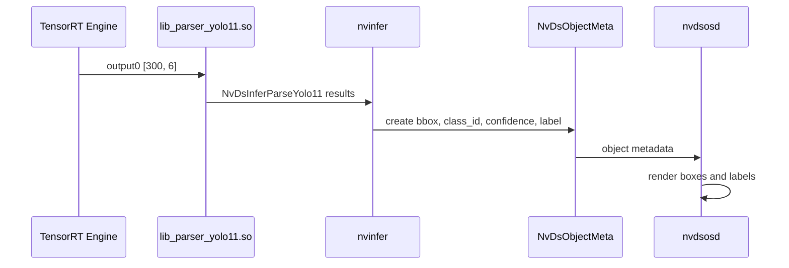

# deepstream_yolo11_4ch_gpu_fp16 Pipeline

## Pipeline

Legend: blue = CPU-bound / GStreamer control, cyan = NVDEC hardware decode, green = GPU / NVMM processing, orange = display sink.

## Runtime Mode

## Detection Metadata Flow

